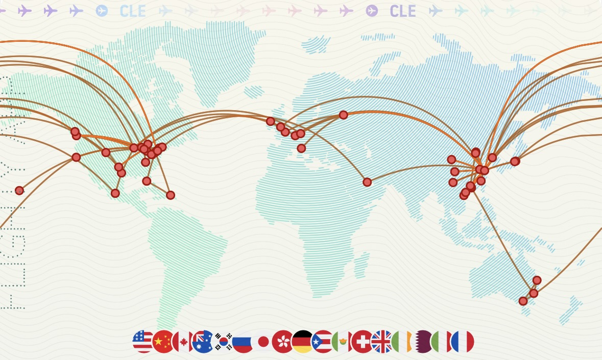

# About Me ✨

<h1 align="center">
  
</h1>

I'm a student at **Northwestern University** with a passion for commercial aviation and flying.

## ✈️ My Aviation Stats & Facts ✈️

| Category | Details |
|----------|---------|
| 🌎 **Current Base** | ORD/MDW (Chicago) |
| 🏠 **Home Airports** | PVG/SHA (Shanghai) |
| ⚡ **Shortest Flight** |  DL 5244 DTW-CLE |
| 🛫 **Longest Flight** |  UA 60 SFO-MEL |
| 💺 **Top Airlines** |  United Airlines (22)  American Airlines (13)  |

## Flight History 🗺️

### Flights I've Previously Taken

### Upcoming Adventures ✨

## Connect With Me ☁️

- 💬 Ask me about aviation and flight experiences
- 🌱 Currently exploring more of the skies
- 📫 How to reach me: [FlightRadar24](https://my.flightradar24.com/lxd262)
- 🏃 Follow my activities: [Strava](https://strava.com/athletes/67091344)

  <i>Happy flying and blue skies!</i> 🛫

